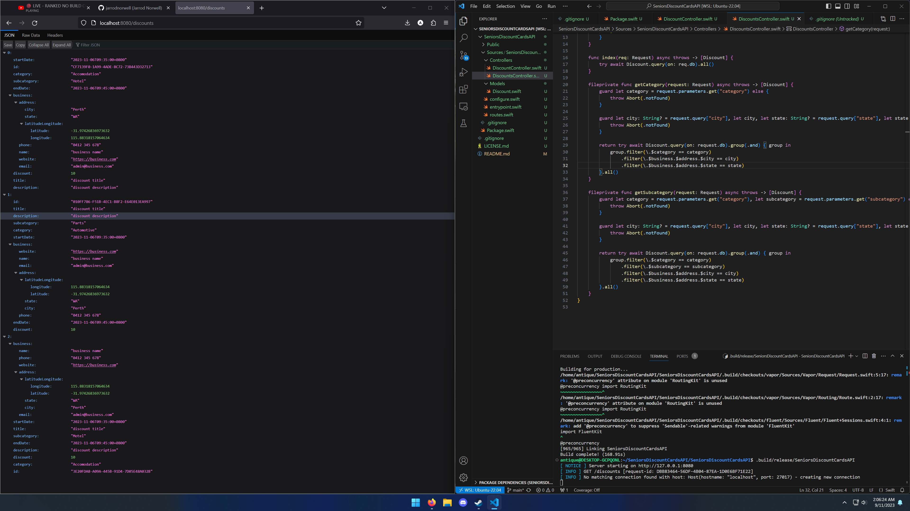
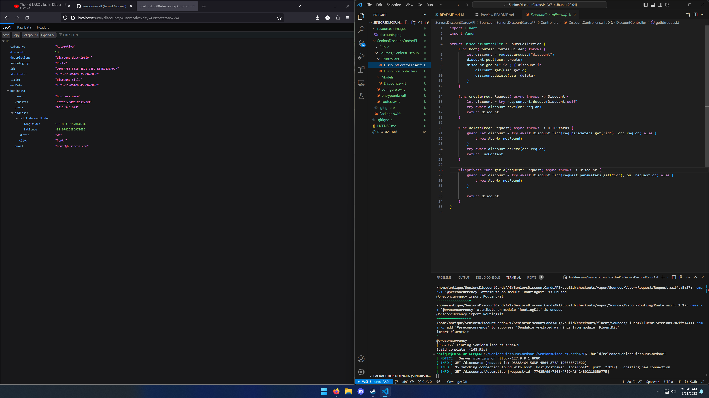

# SeniorsDiscountCardsAPI
API for **[seniorsdiscounts.com.au](https://seniorsdiscounts.com.au)** written in Swift using **[Vapor](https://github.com/vapor/vapor)**

**TODO**

# Screenshots

    

        
    

    

        
    

